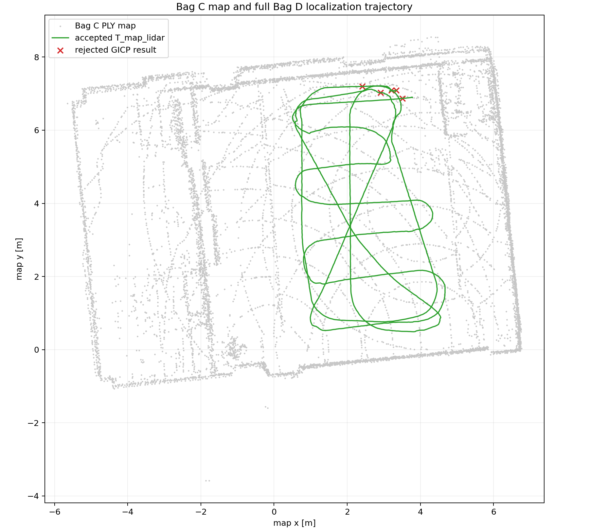

# BUNKER MINI 2.0 Mapping and Localization Research

This repository records a ROS 2 Humble research pipeline for building a LiDAR map with GLIM and localizing independent BUNKER MINI 2.0 runs against that map with official `small_gicp`. The emphasis is reproducibility: successful gates, failed hypotheses, coordinate conventions, dataset roles, and compact result evidence are kept together.

The current production baseline is deliberately narrow. A planar EKF predicts relative `x/y/yaw` motion from odometry and IMU yaw rate between scans. The previous accepted GICP pose retains `z/roll/pitch`, and full-6DoF GICP corrects every scan against the global PLY map. Output remains `T_map_lidar`; the base-to-LiDAR extrinsic is not guessed.



## Current baseline

| Component | Baseline |
|---|---|
| Platform | AgileX BUNKER MINI 2.0 |
| LiDAR | Velodyne VLP-32C (`/velodyne_points`) |
| Mapping | GLIM, Bag C IMU-on map |
| Prediction | `robot_localization` EKF, relative odometry plus IMU `angular_velocity.z` |
| Registration | official `small_gicp`, global map target / current scan source |
| Pose output | `T_map_lidar`, full 6DoF |
| Independent validation | Bag D, 2,176 / 2,181 scans accepted (99.771%) |
| Initialization | map-wide coarse search followed by ranked full-6DoF GICP refinement |
| Canonical quantitative commit | `f099d3d` (with initializer `a1ce8e9` and startup fix `024b38d`) |

Bag D has no independent ground-truth trajectory, so the reported result is a localization robustness and consistency gate—not an absolute accuracy claim. The Bag C map also has unresolved vertical deformation; horizontal localization can remain stable while absolute `z` is not physically trustworthy.

## Problem and research objective

The practical question is whether a map produced on one real-robot drive can support stable localization of a different drive that starts at another pose. The system must find a global seed, survive real sensor startup ordering, and maintain full-6DoF scan registration without pretending that the planar motion filter or an uncalibrated extrinsic supplies physical ground truth.

The test platform is an AgileX BUNKER MINI 2.0 with a Velodyne VLP-32C, IMU, wheel odometry, platform status/RC topics, and commanded velocity. The main data path uses `/velodyne_points`, `/odom`, and `/imu/data`; collection health also uses `/bunker_status`, `/bunker_rc_state`, and `/cmd_vel`.

## Architecture at a glance

```text
odom + IMU yaw rate -> covariance adapter -> relative EKF dx/dy/dyaw
last accepted GICP full 6DoF + planar delta -> registration prediction
Bag C PLY target + current Bag D scan source -> small_gicp -> gated T_map_lidar
```

An independent first scan is initialized through a map-bounded coarse position/full-yaw search followed by ranked full-6DoF GICP refinement. See the [architecture](docs/architecture/localization_pipeline.md) and [transform convention](docs/architecture/transform_conventions.md).

## Research record

- [Documentation index](docs/index.md)
- [System architecture](docs/architecture/localization_pipeline.md)
- [Transform conventions](docs/architecture/transform_conventions.md)
- [2026-08-19 flat dataset](docs/datasets/20260819_flat_dataset.md)
- [Chronological experiment record](docs/experiments/research_chronology.md)
- [Flat-map deformation investigation](docs/experiments/flat_mapping_deformation.md)
- [Bag D independent localization](docs/experiments/bag_d_independent_localization.md)
- [Failures and lessons](docs/failures/ekf_startup_order_discontinuity.md)
- [Reproduction commands](docs/reproduction.md)
- [Curated artifact manifest](docs/artifacts_manifest.md)

The package-level [implementation README](src/bunker_offline_localization/README.md) contains all detailed gate commands and parameters.

## Quick reproduction

```bash
cd /home/a/Desktop/shihoon/bunker_localization_ws
source /opt/ros/humble/setup.bash
colcon build --packages-select bunker_offline_localization --cmake-args -DCMAKE_BUILD_TYPE=Release
source install/setup.bash
colcon test --packages-select bunker_offline_localization --event-handlers console_direct+
colcon test-result --verbose
```

Bag D visualization, using the saved production coarse seed and unchanged localization settings:

```bash
cd /home/a/Desktop/shihoon/bunker_localization_ws && source /opt/ros/humble/setup.bash && source install/setup.bash && ros2 launch bunker_offline_localization bag_d_rviz_localization.launch.py playback_rate:=1.0
```

`playback_rate:=2.0` or `3.0` is for visual convenience only. The production verification result is the existing 1.0× full-bag gate.

## Visual validation


*Independent Bag D localization visual replay on the Bag C map. Gray: Bag C map, green: registered LiDAR scan, yellow: accepted localization path.*

The user observed the registered scan and accepted path moving continuously over the map through the end of a manual 1.0× replay. Its terminal log reported `2,181` LiDAR inputs, `2,181` processed, `2,177` accepted, and `4` rejected. This is a visual continuity/map-alignment sanity check, not quantitative accuracy evidence and not an improvement over the canonical headless result. The canonical quantitative baseline remains `2,176/2,181` accepted with five isolated `NOT_CONVERGED` rejections (`99.771%`).

## Scope and limitations

- This is a Phase 1 offline localization research workspace, not a Nav2 or vehicle-control stack.
- No verified `T_base_lidar` or `T_base_imu` is available; the Phase 1 interface uses documented identity / LiDAR-to-IMU `z=-0.07 m` approximations and publishes LiDAR pose.
- The Bag C GLIM map closes in XY but contains significant vertical deformation. Stage-height validation therefore remains inconclusive.
- No Bag D ground truth exists. Acceptance, continuity, correction magnitude, runtime, and visual map overlay are reported instead of invented absolute RMSE.
- Raw bags and maps live outside Git. Their recorded paths and available checksums are documented; dataset portability still requires an external data archive.
- The coarse global initializer is validated on the current classroom-scale map; arbitrary large-scale relocalization is not yet claimed.
- The recorded strict 20 ms core-latency gate remains failed even though GICP itself is fast; prediction/ROS scheduling latency has a longer tail.

## Next research priorities

1. Measure/calibrate `T_base_lidar` and `T_base_imu`.
2. Validate the resulting `T_map_base` against independent physical references.
3. Rerun flat GLIM mapping with measured extrinsics and re-evaluate vertical deformation.
4. Move the validated offline pipeline toward live localization.
5. Optimize core latency if the deployment budget requires it, then proceed toward planning and vehicle tracking/control integration.
