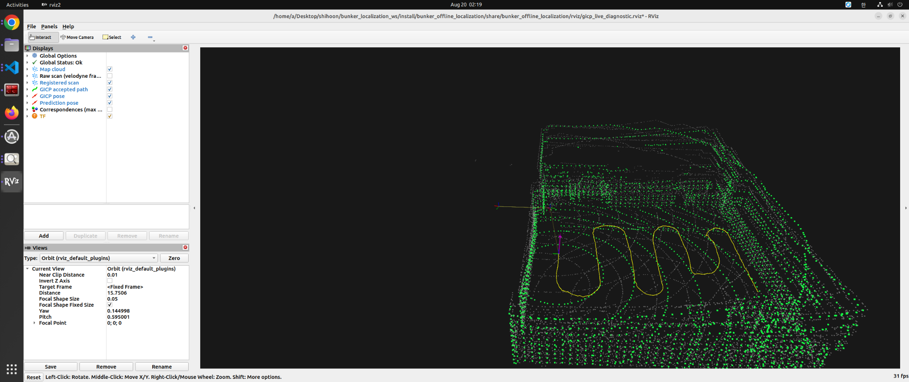

# Curated artifact manifest

Generated `results/` are intentionally ignored because complete experiments include large CSV, PLY, and replay products. A compact selection is copied into `docs/assets/` so the Git history retains the main claims and failures. Copies preserve the original files; the source results are not modified.

| Set | Source result directory | Canonical implementation state | Why bulk output is omitted |
|---|---|---|---|
| Bag D full | `results/bag_D_flat_20260819_localization_full/` | `f099d3d` | full CSV/TUM/latency products are generated and locally reproducible |
| Bag D RViz | `results/bag_D_rviz_localization/` | current uncommitted Bag D visualization state | per-scan CSV/TUM/latency remain generated; compact EOF accounting is retained |
| Bag D coarse | `results/bag_D_flat_20260819_coarse_init/` | `a1ce8e9` | registered first-scan PLY is larger and derivable from the saved seed/run |
| EKF startup | `results/bag_D_prediction_discontinuity_diagnostic/` | `024b38d` | synchronized layer CSVs and replay trees are generated diagnostics |
| vertical diagnostics | `results/gicp_vertical_observability_diagnostic/`, `results/gicp_correspondence_rviz_diagnostic/`, `results/imu_gicp_physical_gate_stage_150mm/` | `33d9363`, `6ddb68a` plus earlier physical gates | only the most explanatory plots/report/JSON are needed in Git |
| filter A/B | `results/filter_comparison/` | `9e60248` | detailed per-scan comparison CSVs/plots are reproducible from saved scripts |

## Bag D full independent localization

| Artifact | Purpose |
|---|---|
| `bag_d_full/summary.json` | machine-readable canonical metrics |
| `bag_d_full/full_bag_localization_report.md` | generated narrative report |
| `bag_d_full/map_trajectory_overlay.png` | independent trajectory over Bag C map |
| `bag_d_full/acceptance_timeline.png` | five isolated non-convergence rejects |
| `bag_d_full/prediction_step_over_time.png` | prediction continuity |
| `bag_d_full/gicp_correction_over_time.png` | full-6DoF correction magnitude |
| `bag_d_full/z_over_time.png` | vertical pose behavior |
| `bag_d_full/roll_pitch_over_time.png` | attitude behavior |

## Initialization and startup failure

| Artifact | Purpose |
|---|---|
| `bag_d_coarse/coarse_initialization.json` | saved selected seed and ranked-search summary |
| `bag_d_coarse/top_candidates.csv` | candidate separation evidence |
| `ekf_startup/before_after_comparison.json` | machine-readable regression comparison |
| `ekf_startup/prediction_discontinuity_before_after_report.md` | diagnosis and minimal correction |

## Bag D RViz validation

| Artifact | Purpose |
|---|---|
| `bag_d_rviz/full_bag_summary.json` | preserved on-disk accounting from one visualization execution; it is not the canonical quantitative baseline or the later manual terminal observation |
| `localization/bag_d_rviz_full_localization_visual_validation.png` | representative Bag C map / registered Bag D scan / accepted path visual sanity check |

*Independent Bag D localization visual replay on the Bag C map. Gray: Bag C map, green: registered LiDAR scan, yellow: accepted localization path. This is visual continuity/map-alignment sanity evidence, not quantitative accuracy evidence.*

## Vertical and physical diagnostics

| Artifact | Purpose |
|---|---|
| `vertical/registration_quality_vs_anomaly.png` | registration metrics versus anomalous vertical behavior |
| `vertical/effective_z_information.png` | effective vertical information diagnostic |
| `vertical/correspondence_xz_largest_negative_dz.png` | selected correspondence geometry in XZ |
| `vertical/independent_minus_mapping_pose_z.png` | mapping/localization vertical discrepancy over time |
| `vertical/gicp_vertical_observability_diagnostic_report.md` | diagnostic interpretation |
| `vertical/height_validation.json` | preserved measured-height screen result |

## Filter comparison

| Artifact | Purpose |
|---|---|
| `filter_ab/comparison_report.md` | EKF/UKF A/B conclusion |
| `filter_ab/filter_comparison.csv` | compact comparison metrics |

SHA-256 hashes and byte sizes of the copied files are recorded in `docs/assets/SHA256SUMS`.
