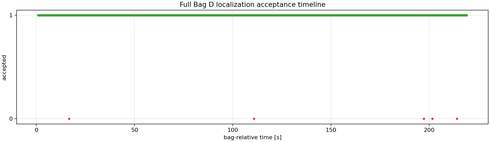
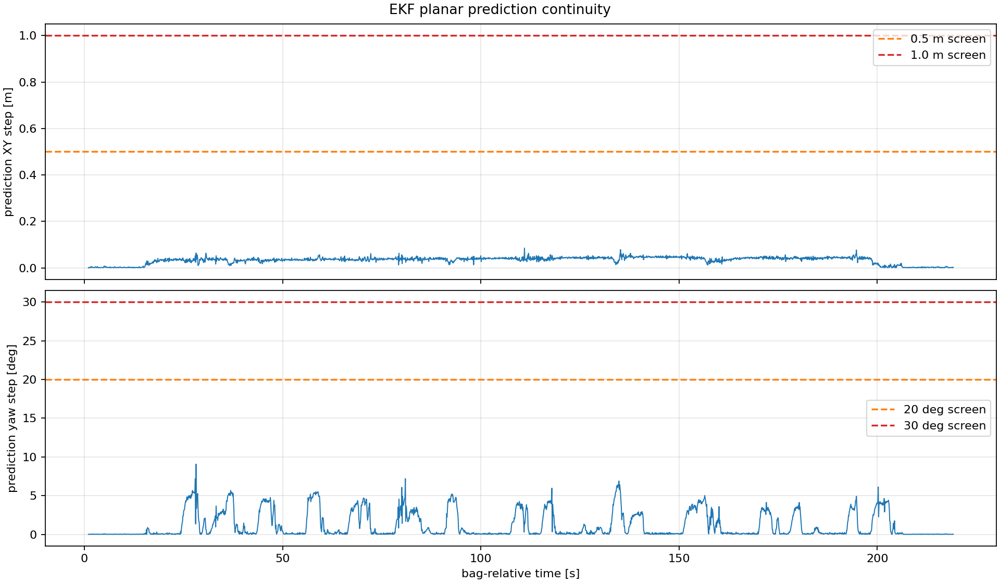

# Bag D independent localization

## Why this is the principal validation

Bag D is a different recording from the Bag C mapping run, with a different start pose and route. It tests whether scans from an independent drive can be registered into the fixed Bag C map. It is stronger evidence than the original same-bag smoke test, while still lacking external ground truth.

## Coarse global initialization

The saved best candidate is loaded from `results/bag_D_flat_20260819_coarse_init/coarse_initialization.json` by the production and RViz launch paths.

| Quantity | Value |
|---|---:|
| translation `x/y/z` (m) | `3.774303 / 6.897196 / 0.133879` |
| roll/pitch/yaw (deg) | `-1.228 / 3.136 / -173.849` |
| inliers | 2,536 |
| error per inlier | 0.121601 |
| top/second score ratio | 1.2766 |
| ambiguity flag | false |

The raw odometry-based anchor differed from this seed by about `3.554 m` in XY and `36.78°` in yaw and was not substituted for it.

## Startup discontinuity correction

The first 0–50 s run showed no jump in raw or frame-adapted odometry, yet the first EKF output differed by `4.593 m` and `94.693°`. Bag D records IMU before the first odometry sample, exposing initialization-order sensitivity when absolute odometry is fused. Setting the existing EKF input to `odom0_relative: true` made the state relative to its first measurement without changing the GICP seed or registration gates.

The short rerun accepted `490/491` scans. Maximum prediction step fell to `0.064 m` and `9.072°`; runs exceeding `1 m` or `30°` disappeared. See the [failure record](../failures/ekf_startup_order_discontinuity.md).

## Full-bag result

| Metric | Result |
|---|---:|
| LiDAR received / processed / skipped | 2,181 / 2,181 / 0 |
| accepted / rejected | 2,176 / 5 |
| acceptance | 99.7707% |
| reject reasons | `NOT_CONVERGED: 5` |
| longest reject run | 1 scan |
| max prediction step | 0.0852 m / 9.0723° |
| GICP correction translation mean / p95 / max | 0.00919 / 0.02175 / 0.06287 m |
| GICP correction rotation mean / p95 / max | 0.329 / 0.799 / 3.342° |
| registration runtime mean / p95 | 2.185 / 2.782 ms |
| core latency mean / p95 | 12.942 / 32.269 ms |
| catastrophic jumps | 0 |





The full report classified the run as PASS under its predefined robustness criteria. It did **not** compute absolute RMSE because no Bag D reference trajectory exists.

## RViz reproduction

The Bag D RViz launch is a thin visualization layer. It reads the same saved `best_candidate.T_map_lidar`, uses `config/independent_bag_D_20260819.yaml`, `config/ekf.yaml`, the Bag C PLY, the same quality gates, the Phase 1 base/LiDAR identity approximation, and the `z=-0.07 m` LiDAR/IMU approximation. It does not use the older 163346 seed.

A 50-scan native-DDS smoke test received `/map_cloud`, `/registered_scan`, `/gicp_pose`, `/gicp_path`, and `/prediction_pose` in `map`, plus `/raw_scan` in `velodyne`; all 50 scans were accepted. Maximum GICP translation difference from the production baseline over those scans was `0.486 mm`. After bag EOF the last map, scan, poses, and path remain available until Ctrl+C.

The canonical quantitative baseline is the headless Full Bag D Gate: `2,176/2,181` accepted, five isolated `NOT_CONVERGED` rejections, and `99.771%` acceptance. A later manual 1.0× RViz visualization replay produced terminal counts of `lidar=2181`, `processed=2181`, `accepted=2177`, and `rejected=4`. The user visually confirmed that the registered scan and accepted path moved continuously over the Bag C map through EOF without a large localization jump. The one-scan difference is retained as observed replay variability—not an improvement—and the visual replay does not replace the canonical quantitative baseline.


*Independent Bag D localization visual replay on the Bag C map. Gray: Bag C map, green: registered LiDAR scan, yellow: accepted localization path. This screenshot is visual continuity/map-alignment sanity evidence, not quantitative accuracy evidence.*

A one-time `Detected jump back in time. Clearing TF buffer.` warning occurred during the playback-start `/clock` reset. Because all 2,181 scans were subsequently processed, it is recorded as a benign startup warning for that replay. It is not treated as a generally ignorable TF warning.

The preserved `docs/assets/bag_d_rviz/full_bag_summary.json` came from another saved visualization execution and records `2,176/2,181`; it remains an audit artifact rather than evidence that overrides the later manual terminal observation. Neither visualization execution replaces the headless `f099d3d` baseline.

```bash
cd /home/a/Desktop/shihoon/bunker_localization_ws && source /opt/ros/humble/setup.bash && source install/setup.bash && ros2 launch bunker_offline_localization bag_d_rviz_localization.launch.py playback_rate:=1.0
```
