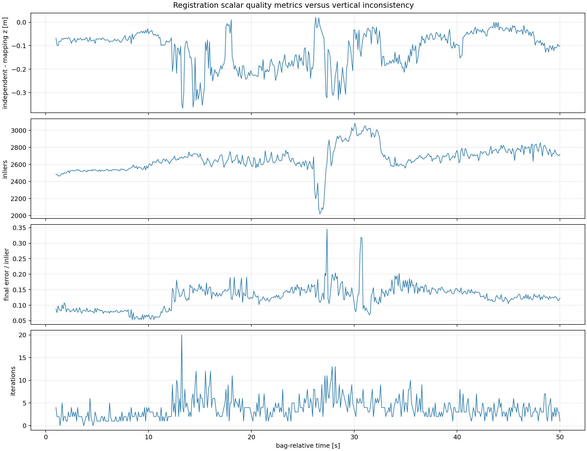
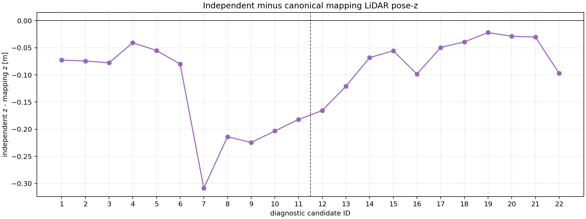

# Flat-map vertical deformation investigation

## Observation

The production Bag C IMU-on GLIM trajectory has near-zero XY closure displacement (`0.00287 m`) over a `104.33 m` XY path, but its LiDAR pose `z` spans `0.8219 m` in an environment expected to contain broad flat surfaces. Independent localization can overlay well in XY while inheriting or exposing this vertical inconsistency.

## Controlled comparisons

All numbers below are trajectory summaries, not ground-truth errors.

| GLIM variant | XY path (m) | XY closure (m) | `z` range (m) | Observation |
|---|---:|---:|---:|---|
| IMU on, production | 104.333 | 0.0029 | 0.8219 | best usable horizontal map; vertical deformation remains |
| LiDAR only | 328.101 | 6.1371 | 7.8202 | severe trajectory collapse/drift |
| IMU translation `z=0` | 103.959 | 0.0049 | 0.9104 | did not remove vertical deformation |
| IMU translation `z=+0.07 m` | 103.902 | 0.0149 | 0.7990 | did not establish an extrinsic solution |
| `fix_imu_bias=true` | 104.388 | 0.0053 | 0.7136 | changed the trajectory but did not resolve the issue |

These experiments reject simple explanations such as “LiDAR-only will be safer,” “the warning alone proves the translation is wrong,” or “one bias flag fixes the map.” The root cause is still unresolved. Sensor timing and early motion comparisons did not isolate a single cause, and the evidence should not be overclaimed.

| Hypothesis | Experiment | Observation | Decision |
|---|---|---|---|
| LiDAR-only avoids IMU coupling | rerun without IMU | XY path and `z` diverged severely | reject LiDAR-only as the flat-map baseline |
| one LiDAR/IMU `z` translation causes the deformation | compare `z=0` and `z=+0.07 m` variants | neither restored a physically flat trajectory | do not declare an extrinsic from this one-factor sweep |
| fixed IMU bias is the root fix | enable `fix_imu_bias` | `z` range changed but remained substantial | preserve as a negative result; root cause unresolved |
| warning/timing/motion/heading alone explains NEW vs OLD | compare the successful 150626 run and Bag C diagnostics | warning also existed in OLD, timing was similar, and early NEW motion was not simply more aggressive | no single tested factor explains the mismatch |

## Localization-side evidence

The vertical-observability diagnostic found that ordinary convergence/error/inlier metrics can remain acceptable during anomalous `z` evolution. It also rejected an overly simple “weak final Hessian caused the drop” explanation: all accepted Hessians were finite/full-rank, and the anomaly group's final-Hessian effective `z` information was higher—not lower—than baseline. A healthy local Hessian at the final solution cannot rule out wrong correspondences, another local minimum, or a multi-modal cost landscape.

The accepted-anchor invariant had zero violations. The largest negative accepted GICP correction was `-0.246565 m`; several large alternating corrections between candidate regions 6 and 7 put the accepted anchor into an already-low basin. The next prediction then correctly inherited that GICP anchor. This rules out smooth standalone EKF `z` integration as the immediate mechanism, while not proving a unique mapping or correspondence root cause.

Post-hoc correspondence reconstruction found similar aggregate distance quality to baseline and supported only the diagnostic interpretation “wrong but locally consistent correspondence basin plausible.” The selected plots relate registration quality and mapping/localization discrepancy to the anomaly without promoting that interpretation to ground truth.

The physical stage-height gate used a manually measured `0.150 m` height with a `0.050 m` initial screening tolerance. Candidate plateaus were detected without using the measured height, then compared post hoc. The original temporal labeling was not independently established, the fitted ground-plane slope was about `8.206°`, and the final diagnostic conclusion remained inconclusive. The `HEIGHT_FAIL` record is preserved as a failed screen, not renamed to a localization failure.

## Practical consequence

For the current baseline:

- trust `T_map_lidar` continuity and the observed XY overlay within the tested map;
- do not advertise Bag C absolute `z` as survey-grade height;
- do not tune GICP to force agreement with the 0.150 m stage measurement;
- acquire independently surveyed control surfaces/poses and calibrated extrinsics before claiming vertical accuracy;
- regenerate or correct the map only in a separately scoped mapping investigation.
