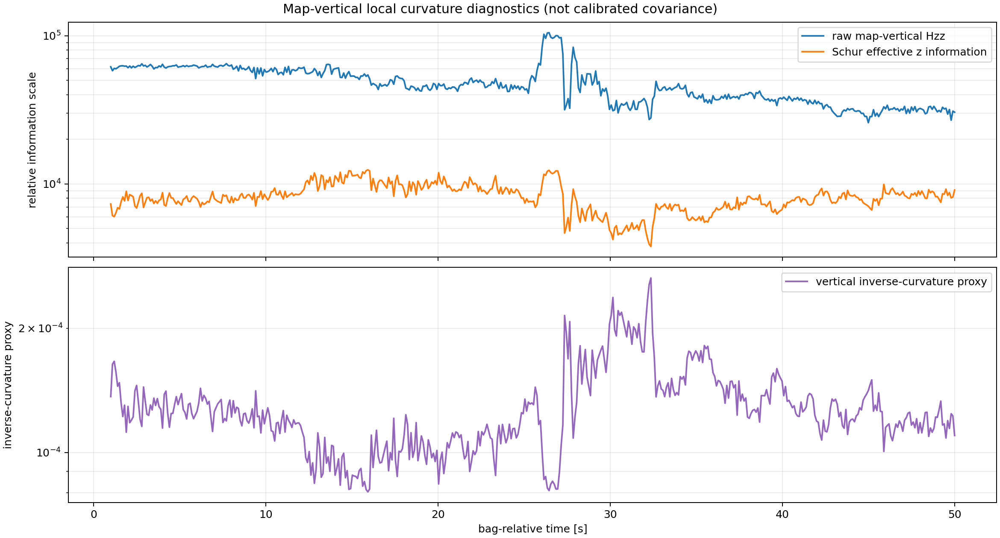

# Vertical localization diagnostics

## What failed

The initial physical consistency gate compared automatically detected stable plateaus with a manually measured stage height of `0.150 m`, using `0.050 m` only as an initial screening tolerance appropriate to the `0.20 m` map/scan voxel scale. The gate recorded `HEIGHT_FAIL`.

That status is preserved. It is not a calibrated accuracy threshold and is not interpreted as failure of the complete production localizer.

## Why the conclusion is inconclusive

- Plateau candidates were found from low absolute `z` rate, low absolute pitch rate, duration, accepted-pose continuity, and timestamp continuity—never from closeness to `0.150 m`.
- The original temporal partition labeled candidate 4 as stage top and candidates 5–7 as ground after, but those physical labels were not independently established.
- The fitted ground-plane slope was about `8.206°`, which is itself a warning that surface labeling or the mapped geometry is questionable.
- Full trajectory `z max-min` (about `0.374 m` in that diagnostic interval) was explicitly not used as stage height.
- Local PLY support extraction found sparse/multiple plausible horizontal components in relevant areas. The final-Hessian diagnostic did **not** support a simple region-specific loss of vertical curvature: accepted Hessians remained full-rank and anomaly effective `z` information was not lower than baseline.

The correct conclusion is: **height validation is currently inconclusive because physical plateau labels are not independently established**.

## Why XY can still look good

Walls, edges, and the room layout can strongly constrain lateral position and yaw even when multiple vertically shifted surface correspondences are locally plausible. GICP can therefore have many inliers and a visually good XY overlay while settling at a biased `z` relative to a vertically inconsistent map.

The accepted-anchor audit recorded zero invariant violations. Around the main drop, several large alternating accepted GICP `z` corrections—including one `-0.246565 m` step—moved the anchor before the next prediction inherited it. The EKF is not freely integrating `z`; each accepted full-6DoF GICP pose supplies it. The supported diagnostic is “final Hessian insufficient; wrong but locally consistent correspondence basin plausible,” not “EKF height drift” and not a proven single map defect.

## Required next evidence

- independently surveyed ground/stage regions and timestamps;
- measured `T_base_lidar` and LiDAR/IMU extrinsics;
- a map generated after isolating the GLIM vertical-deformation cause;
- comparison against an external 6DoF reference or surveyed landmarks.
